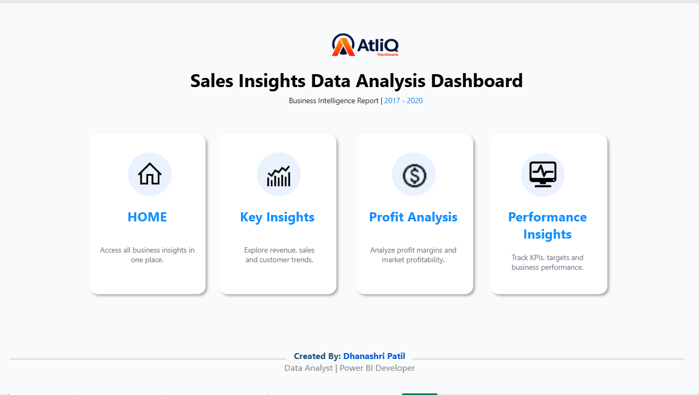

# 📊 Sales Insights Data Analysis – AtliQ Hardware

> A Power BI Sales Analytics project focused on transforming transactional sales data into meaningful business insights using **MySQL, Power Query, DAX and Power BI**.

This project is based on the **AtliQ Hardware Sales Insights learning case study**. I used the learning material to understand the business problem, dataset and overall analytics workflow, while independently implementing the **data exploration, SQL analysis, data cleaning, data modeling, DAX measures, dashboard design and presentation**.

> **Transparency:** The original AtliQ Hardware business case and learning material are not my original creation. This repository represents my own practical implementation and portfolio presentation based on publicly available learning resources.

---

## 🛠️ Tools Used

**MySQL • MySQL Workbench • Power Query • DAX • Power BI • GitHub**

---

## 📌 Table of Contents

* [Business Problem](#-business-problem)
* [Project Objectives](#-project-objectives)
* [Project Planning](#-project-planning)
* [Data Discovery](#-data-discovery)
* [SQL Analysis](#-sql-analysis)
* [Data Cleaning & ETL](#-data-cleaning--etl)
* [Data Modeling](#-data-modeling)
* [DAX Measures](#-dax-measures)
* [Power BI Dashboard](#-power-bi-dashboard)
* [Business Questions](#-business-questions)
* [Repository Structure](#-repository-structure)
* [How to Run](#-how-to-run-the-project)
* [Limitations](#-limitations)
* [Learning Outcomes](#-learning-outcomes)

---

# ❗ Business Problem

AtliQ Hardware is presented in the learning case study as an India-based company that supplies computer hardware and peripherals across different markets.

As the business grows, the Sales Director needs a better way to understand sales performance. Sales information is spread across different markets, and reporting involves manual data gathering.

This makes it difficult to get a clear and consistent view of:

* Sales performance
* Market performance
* Customer performance
* Product performance
* Revenue trends
* Profitability

### Business Need

The project aims to create an interactive Power BI report that helps users:

* Monitor sales performance
* Compare market performance
* Analyze customers and products
* Understand revenue and profitability trends
* Compare current performance with the previous year
* Compare profit margin with a selected target
* Analyze zone-level performance
* Reduce manual reporting effort

---

# 🎯 Project Objectives

The main objectives of this project are:

1. Explore and understand the available sales data.
2. Analyze customers, products, markets, transactions and dates using MySQL.
3. Identify data-quality issues in the source data.
4. Clean and transform the data using Power Query.
5. Convert USD transactions into INR using the case-study assumption.
6. Build a structured, star-schema-oriented data model.
7. Create reusable DAX measures for sales and profitability analysis.
8. Perform year-over-year analysis.
9. Create profit-target analysis.
10. Build an interactive four-page Power BI report.
11. Present the analysis in a simple and business-friendly format.

---

# 🧭 Project Planning

The project planning follows the **AIMS Grid approach** used in the learning case study.

### Purpose

Create a centralized sales analysis report that makes sales and profitability information easier to understand and explore.

### Stakeholders

* Sales Director
* Sales Team
* Marketing Team
* Customer Service Team
* Data & Analytics Team
* IT / Technical Team

### End Result

An interactive Power BI report containing:

* KPIs
* Charts
* Tables
* Filters
* Year-over-year analysis
* Profit-target analysis
* Page navigation

### Project Workflow

```text
Business Problem
       ↓
Project Planning
       ↓
Data Discovery
       ↓
SQL Analysis
       ↓
Data Cleaning & ETL
       ↓
Data Modeling
       ↓
DAX Measures
       ↓
Power BI Dashboard
       ↓
Business Analysis
```

### Project Execution Flow


---

# 🔎 Data Discovery

The dataset contains transaction-level sales information along with customer, product, market and date tables.

The first step was to understand the available tables and identify data-quality issues before building the Power BI report.

## Available Tables

| Table                | Type      | Purpose                           |
| -------------------- | --------- | --------------------------------- |
| `sales.transactions` | Fact      | Transaction-level sales data      |
| `sales.customers`    | Dimension | Customer information              |
| `sales.products`     | Dimension | Product information               |
| `sales.markets`      | Dimension | Market and geographic information |
| `sales.date`         | Dimension | Date, month and year information  |

### Database Import

The database was imported into **MySQL Workbench** for initial exploration and SQL analysis.


---

# 🧮 SQL Analysis

**MySQL** was used to explore the dataset, understand the table structure and identify data-quality issues before the Power BI transformation stage.

### SQL Analysis Covered

#### Customer Analysis

* Viewed customer records
* Counted customers
* Explored customer-level data

#### Market Analysis

* Checked available markets
* Analyzed market-level transactions
* Compared sales across markets
* Investigated blank or invalid market records

#### Product Analysis

* Explored available products
* Checked product codes
* Analyzed product-level transaction data

#### Currency Analysis

* Identified USD transactions
* Checked INR and USD values
* Investigated inconsistent currency values

#### Time-Based Analysis

* Analyzed 2019 and 2020 transactions
* Calculated yearly revenue
* Calculated monthly revenue
* Compared revenue across different periods

### SQL Files

* `sales_insights.sql`
* `sales_SQL_analysis.sql`

---

# 🧹 Data Cleaning & ETL

After the initial SQL analysis, the data was connected to **Power BI Desktop** and transformed using **Power Query**.

### ETL Workflow

```text
MySQL
  ↓
Power BI
  ↓
Power Query
  ↓
Data Cleaning
  ↓
Currency Normalization
  ↓
Close & Apply
  ↓
Data Model
```

## Key Cleaning Steps

### 1. Market Data

Blank and invalid market records were identified during data exploration and filtered during Power Query transformation.

### 2. Transaction Data

The transaction data was checked for:

* Zero sales values
* Negative sales values
* Invalid records
* Currency inconsistencies

Unwanted zero and negative sales records were removed from the analysis.

### 3. Currency Normalization

The source data contained both **INR and USD** transactions.

For this project, USD values were converted into INR using the fixed case-study assumption:

> **1 USD = 75 INR**

The Power Query transformation used:

```powerquery
= Table.AddColumn(
    #"Filtered Rows",
    "norm_sales_amount",
    each if [currency] = "USD"
         then [sales_amount] * 75
         else [sales_amount]
)
```

### 4. Currency Standardization

The source data contained variations such as:

```text
INR
INR\r
USD
USD\r
```

These variations were investigated during SQL analysis and handled during the data-cleaning process.

### 5. Load Transformed Data

After completing the required transformations, **Close & Apply** was used to load the cleaned data into Power BI.

---

# 🧩 Data Modeling

The cleaned dataset was organized into a **star-schema-oriented model**.

The transaction table acts as the central fact table, while customers, products, markets and dates act as dimension tables.

### Fact Table

* `sales.transactions`

### Dimension Tables

* `sales.customers`
* `sales.products`
* `sales.markets`
* `sales.date`

### Supporting Tables

* `Key Measures`
* `Profit Target 2`

### Data Model


### Data Model & Key Measures


The model supports analysis across:

* Markets
* Customers
* Products
* Zones
* Dates

---

# 📐 DAX Measures

DAX was used to create reusable measures for:

* Sales KPIs
* Profitability
* Contribution analysis
* Year-over-year comparison
* Growth analysis
* Profit-target analysis

## Core Measures

### Revenue

```DAX
Revenue =
SUM('Sales transactions'[sales_amount])
```

### Sales Quantity

```DAX
Sales Qty =
SUM('sales transactions'[sales_qty])
```

### Total Profit Margin

```DAX
Total Profit Margin =
SUM('Sales transactions'[Profit_Margin])
```

### Profit Margin %

```DAX
Profit Margin % =
DIVIDE(
    [Total Profit Margin],
    [Revenue],
    0
)
```

---

## Contribution Measures

### Revenue Contribution %

```DAX
Revenue Contribution % =
DIVIDE(
    [Revenue],
    CALCULATE(
        [Revenue],
        ALL('sales products'),
        ALL('sales customers'),
        ALL('sales markets')
    )
)
```

### Profit Margin Contribution %

```DAX
Profit Margin Contribution % =
DIVIDE(
    [Total Profit Margin],
    CALCULATE(
        [Total Profit Margin],
        ALL('sales products'),
        ALL('sales customers'),
        ALL('sales markets')
    )
)
```

---

## Year-over-Year Measures

### Revenue LY

```DAX
Revenue LY =
CALCULATE(
    [Revenue],
    SAMEPERIODLASTYEAR('sales date'[date])
)
```

### Sales Qty LY

```DAX
Sales Qty LY =
CALCULATE(
    [Sales Qty],
    SAMEPERIODLASTYEAR('sales date'[date])
)
```

### Profit Margin LY

```DAX
Profit Margin LY =
CALCULATE(
    [Total Profit Margin],
    SAMEPERIODLASTYEAR('sales date'[date])
)
```

---

## Growth Measures

### Revenue Growth %

```DAX
Revenue Growth % =
DIVIDE(
    [Revenue] - [Revenue LY],
    [Revenue LY]
)
```

### Sales Growth %

```DAX
Sales Growth % =
DIVIDE(
    [Sales Qty] - [Sales Qty LY],
    [Sales Qty LY]
)
```

### Profit Margin Growth %

```DAX
Profit Margin Growth % =
DIVIDE(
    [Total Profit Margin] - [Profit Margin LY],
    [Profit Margin LY]
)
```

---

## Profit Target Analysis

A selectable profit-target range was created using a DAX-generated table.

### Profit Target 2

```DAX
Profit Target 2 =
GENERATESERIES(
    -0.05,
    0.15,
    0.01
)
```

This creates the profit-target values used by the report.

### Profit Target Value 2

```DAX
Profit Target Value 2 =
SELECTEDVALUE(
    'Profit Target 2'[Profit Target]
)
```

This returns the currently selected target.

### Target Difference

```DAX
Target Diff =
[Profit Margin %]
    - 'Profit Target 2'[Profit Target Value 2]
```

This calculates the difference between actual profit margin and the selected target.

---

# 📊 Power BI Dashboard

The final Power BI report contains **four pages**, with each page designed for a specific analytical purpose.

```text
Home
  ↓
Key Insights
  ↓
Profit Analysis
  ↓
Performance Insights
```

---

# 🏠 Home

The **Home** page acts as the landing and navigation page.

### Includes

* Project branding
* Page navigation
* Navigation icons
* Report layout and design elements

### Home Dashboard



The navigation and dashboard assets are available in the `logo/` folder.

---

# 📈 Key Insights

The **Key Insights** page provides an overall view of sales performance.

### KPIs

* Revenue
* Sales Quantity
* Total Customers
* Total Markets
* Vs Last Year

### Visuals

* Revenue by Market
* Sales Quantity by Market
* Revenue Trend
* Sales Quantity Trend
* Top 5 Products
* Top 5 Customers
* Year Filter
* Time-period analysis

### Purpose

This page provides an overall view of **sales, markets, products, customers and sales trends**.


---

# 💰 Profit Analysis

The **Profit Analysis** page focuses on revenue contribution and profitability.

### KPIs

* Revenue
* Sales Quantity
* Total Profit Margin
* Vs Last Year

### Visuals

* Revenue Contribution % by Market
* Profit Margin % by Market
* Profit Margin Contribution % by Market
* Revenue Trend
* Customer-level profitability analysis
* Year Filter
* Time-period analysis

### Purpose

This page focuses on **market contribution, profitability and customer-level performance**.

### Dashboard


---

# 🎯 Performance Insights

The **Performance Insights** page focuses on comparative and target-based analysis.

### KPIs

* Revenue
* Sales Quantity
* Total Profit Margin
* Vs Last Year
* Profit Target

### Visuals

* Profit Margin % by Market
* Revenue Trend
* Revenue LY comparison
* Revenue by Zone
* Profit Margin % by Zone
* Customer performance analysis
* Profit Target analysis

### Purpose

This page helps analyze **year-over-year performance, profit targets, market performance, zone performance and customer performance**.

### Dashboard


---

# 🎬 Overall Dashboard Walkthrough

The overall dashboard walkthrough is presented below.

### Dashboard Preview


---

# 🔍 Business Questions

The dashboard was designed to answer practical business questions such as:

### Sales

* What is the overall revenue?
* What is the total sales quantity?
* How are sales changing over time?
* How does current performance compare with last year?

### Markets

* How is revenue distributed across markets?
* How does sales quantity vary across markets?
* How does profit margin differ across markets?

### Customers & Products

* Which customers contribute to revenue?
* How does profitability vary across customers?
* Which products appear in the Top 5?

### Zones

* How is revenue distributed across zones?
* How does profit margin vary across zones?

### Profitability

* What is the total profit margin?
* What is the profit margin percentage?
* How is profit contribution distributed across markets?

### Target Analysis

* What is the selected profit target?
* How does actual profit margin compare with the selected target?
* What is the difference between actual performance and the selected target?

---

# 📁 Repository Structure

```text
.
├── README.md
├── Sales Insights of Data Analysis - AtliQ Hardware .pbix
├── sales_insights.sql
├── sales_SQL_analysis.sql
│
├── image/
│   ├── Data Import.png
│   ├── Data Model + Key Measures.png
│   ├── Data model.png
│   ├── Flowchart.png
│   ├── Home.png
│   ├── Import completed.png
│   ├── Key Insights.png
│   ├── overall Dashbboard.mp4
│   ├── Performance Insights.png
│   └── Profit Analysis.png
│
└── logo/
    ├── Atliq logo.png
    ├── Customers.png
    ├── home.png
    ├── images.png
    ├── key insights.png
    ├── Markets.png
    ├── Performance insights.png
    ├── profit analysis.png
    ├── profit.png
    ├── Revenue.png
    └── sales qty.png
```

---

# ▶️ How to Run the Project

### 1. Open the Power BI File

Clone or download the repository and open:

```text
Sales Insights of Data Analysis - AtliQ Hardware .pbix
```

using **Power BI Desktop**.

### 2. Review the Data Model

Open **Model View** to inspect the relationships between the fact and dimension tables.

### 3. Review Power Query

Open:

**Home → Transform Data**

to inspect the data-cleaning and currency-normalization steps.

### 4. Review DAX

Review the measures used for:

* Revenue
* Sales Quantity
* Profit Margin
* Contribution Analysis
* Year-over-Year Analysis
* Growth Analysis
* Vs Last Year
* Profit Target
* Target Difference

### 5. Review SQL

Open the following files using **MySQL Workbench**:

```text
sales_insights.sql
sales_SQL_analysis.sql
```

### 6. Explore the Dashboard

Navigate through:

**Home → Key Insights → Profit Analysis → Performance Insights**

---

# ⚠️ Limitations

* The project uses a learning/case-study dataset rather than a live enterprise data source.
* USD-to-INR conversion uses the fixed assumption **1 USD = 75 INR**.
* The exchange-rate assumption is not a live foreign-exchange rate.
* Source-data quality limitations are part of the learning dataset.
* This is a portfolio implementation and not an official internal AtliQ Hardware system.
* Automated refresh, governance, security and enterprise data-management processes are outside the current project scope.

---

# 🙌 Learning Outcomes

This project provided practical experience across the end-to-end data analytics workflow.

### Technical Skills

* SQL
* MySQL
* MySQL Workbench
* Power Query
* ETL
* Data Cleaning
* Data Modeling
* DAX
* Power BI

### Analytics Skills

* Data Exploration
* Business Analysis
* Data Visualization
* KPI Development
* Year-over-Year Analysis
* Profitability Analysis
* Target Analysis
* Dashboard Design
* Data Storytelling

### End-to-End Workflow

```text
Business Problem
       ↓
Data Exploration
       ↓
SQL Analysis
       ↓
Data Cleaning
       ↓
Data Modeling
       ↓
DAX Measures
       ↓
Power BI Dashboard
       ↓
Business Analysis
```

This project helped me practice how raw transactional data can be transformed into an interactive business intelligence report using **SQL, Power Query, DAX and Power BI**.
